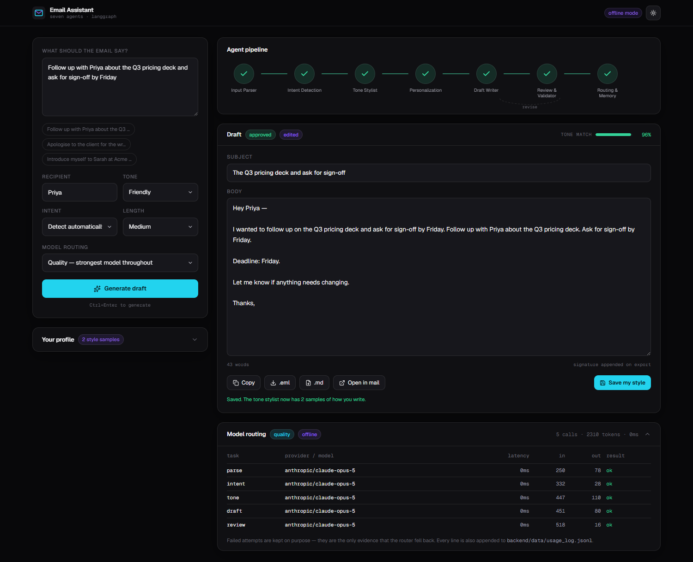
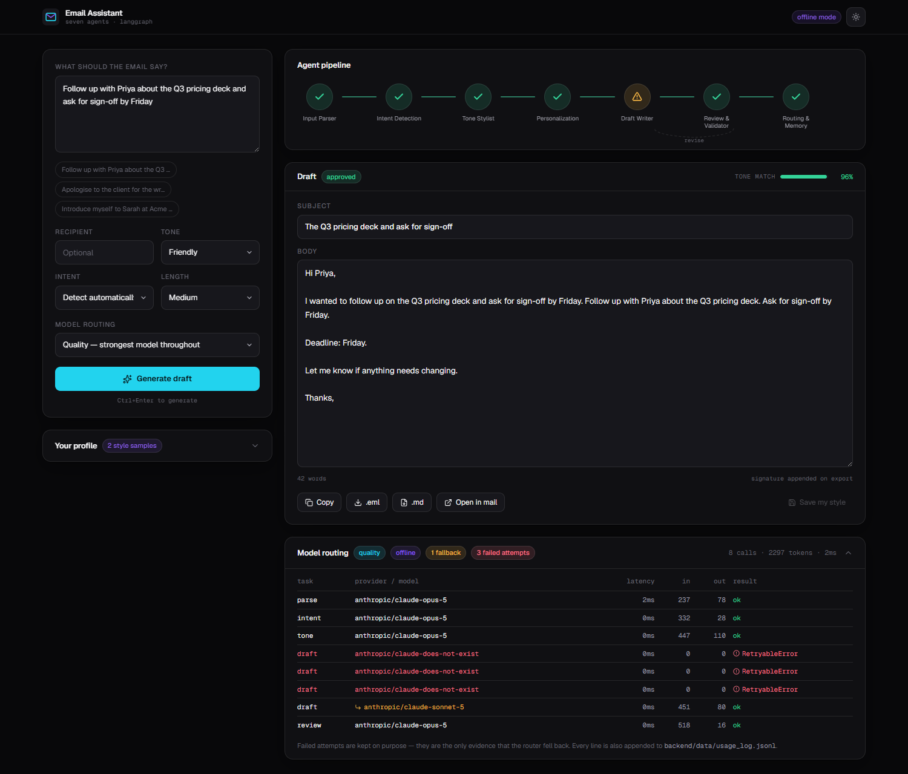
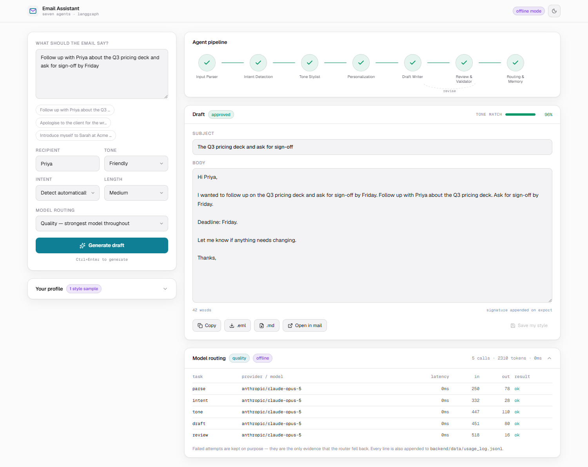

# AI-Powered Email Assistant

Seven cooperating agents turn a one-line request into a polished, editable email.
A LangGraph pipeline parses the request, classifies its intent, builds a style
contract, personalizes it, writes the draft, reviews it, and — if review objects —
sends it back to be rewritten. Every model call is routed through a control plane
that falls back across Anthropic and OpenAI and logs what actually served each step.

Capstone for *Applied Agentic AI for SWEs*.



**It runs with no API key.** A deterministic offline provider answers from the
prompt itself, so a fresh clone starts, passes its tests, and demos end to end at
zero cost. Add a key to `.env` and the same code paths call real models.

---

## Quick start

```bash
git clone <this repo> && cd email_assistant

# Backend
cd backend
uv venv && uv pip install -r requirements-dev.txt     # or: python -m venv .venv && pip install -r requirements-dev.txt
FAKE_LLM=1 PYTHONPATH=src .venv/bin/uvicorn email_assistant.api.app:app --reload

# Frontend, in a second terminal
cd frontend && pnpm install && pnpm dev
```

Open <http://localhost:5173>.

Or the whole thing at once — also keyless by default:

```bash
docker compose up --build      # UI on :3000, API on :8000
```

### Going live

```bash
cp .env.example .env
# set ANTHROPIC_API_KEY and/or OPENAI_API_KEY, then set FAKE_LLM=0
```

One key is enough. The router skips any provider without a credential, so with
only an Anthropic key the OpenAI fallbacks are quietly passed over rather than
failing.

### Without a browser

```bash
cd backend
PYTHONPATH=src python -m email_assistant.cli \
  "Follow up with Priya on the Q3 pricing deck and ask for sign-off by Friday" \
  --tone friendly --intent follow-up
```

Exit codes: `0` approved, `1` needs review, `2` failed.

---

## The seven agents

Each is a plain function `(state) -> dict`. None of them touches an SDK directly —
they all call the router — which is what makes every one of them testable against
a stub in isolation.

| Agent | File | Does | Model call |
|---|---|---|---|
| Input Parser | `agents/input_parser_agent.py` | Recipient, key points, constraints, length, language. Rejects a request too short to write from. | `parse` |
| Intent Detection | `agents/intent_detection_agent.py` | One of seven intents, with confidence. Skipped entirely when you pick one in the UI. | `intent` |
| Tone Stylist | `agents/tone_stylist_agent.py` | Turns a tone name into a checkable style contract. | `tone` |
| Personalization | `agents/personalization_agent.py` | Loads your profile and how you have edited past drafts. | — |
| Draft Writer | `agents/draft_writer_agent.py` | Writes the email. Re-runs with the reviewer's instructions on rejection. | `draft` |
| Review & Validator | `agents/review_agent.py` | Grammar, tone, coherence, and invented facts. Can send the draft back. | `review` |
| Routing & Memory | `agents/router_agent.py` | Settles the final status and saves the draft. | — |

### Why tone is a contract, not an adjective

"Write in a friendly tone" is not reproducible across models or runs, and the
reviewer cannot check it. So the stylist emits a `ToneSpec` instead: an exact
greeting form, an exact closing, a sentence-length target, a banned-phrase list,
and three to six rules that can each be verified by reading the finished draft.
The writer follows it and the reviewer checks against it, so the two cannot
disagree about what the tone meant.

### The flow

```
START → input_parser → intent_detection → tone_stylist → personalization → draft_writer → review
                                                                              ↑            │
                                                                              └── revise ───┤ attempts ≤ 2
                                                                                           │
                                                                            router_agent ←─┘ passed | exhausted → END
```

The revision loop is a LangGraph conditional edge, not a retry hidden inside the
writer. That keeps the decision in one readable place, makes the bound
enforceable, and — because it is a real edge — lets the UI draw it firing.

Two revisions is the cap. Past that the reviewer and writer are usually
deadlocked, so the run degrades to `needs_review` and hands back the best draft
with its outstanding issues attached. A draft with known problems is more useful
than no draft.

---

## Model routing (the control plane)

`backend/config/mcp.yaml` maps each agent task to an ordered list of candidate
models. The router walks them and returns the first success.

```yaml
draft:
  primary:   {provider: anthropic, model: claude-opus-5}
  fallbacks: [{provider: anthropic, model: claude-sonnet-5},
              {provider: openai,    model: gpt-4o}]
```

Two profiles ship, switchable from the UI:

- **quality** — the strongest model for every task. Nothing is silently downgraded.
- **cost** — cheap models for extraction and classification, mid-tier for tone and
  review, and the strong model still on `draft`. The draft is the deliverable.

**What triggers a fallback:** rate limits, 5xx, connection failures, policy
refusals, an unknown model id, and schema-validation failures. A model that will
not return the requested shape has not answered, so the next candidate gets a turn.

**What does not:** a `400`. That means *we* built a malformed request, and trying
the same malformed request against a second model would turn our own bug into a
slower, more expensive, identical failure that looks like a provider outage.

Every attempt — including each failure — lands in the run trace and in
`backend/data/usage_log.jsonl`. The failures are the only evidence that fallback
happened, so they are kept rather than discarded:



Reproduce that yourself: point `quality.draft.primary.model` at a nonexistent
model and run the CLI. Three attempts fail, the fourth is served by the fallback,
and the draft still completes.

---

## Memory, and the part that actually learns

`backend/data/profiles.json` holds your identity, signature, default tone, recent
drafts, and recent edits. Writes go through a temp file and `os.replace`, because
a half-written file would take the accumulated style history with it.

The loop that closes:

1. You edit a generated draft in the UI and press **Save my style**.
2. The store records `{original, edited, diff}`.
3. On the next run the Tone Stylist receives your last three edits as evidence of
   how you actually write, and is told they override the generic tone sample.

The diff is the point. Storing only your final text reads as an unrelated writing
sample; storing the before and after shows the *direction* of the correction.
Unchanged saves are dropped — pressing save without editing teaches nothing.

---

## The UI

Dark-first with a light toggle, set before first paint so light-mode users never
see a flash. The pipeline rail is the centrepiece: seven nodes advancing live off
the SSE stream, amber on a node whose model fell back, a badge when a node re-ran,
and a dashed arc under review that lights when a draft is sent back.

That rail exists because the architecture is otherwise invisible. A working app
looks identical whether it runs seven agents or one prompt.



The draft appears as soon as the writer finishes, while review is still running —
there is no reason to make you wait to start reading. Export is copy, `.eml`
(opens as a real editable draft in Outlook and Mail), `.md`, or `mailto:`.

---

## Streaming

`POST /api/generate` returns Server-Sent Events. FastAPI's `EventSourceResponse`
drives a sync iterable through a threadpool, so the LangGraph pipeline streams
without an async rewrite.

| Event | Carries |
|---|---|
| `run_start` | session id, routing profile, the agent list the rail draws |
| `agent_start` | the node now running |
| `agent_status` | a human-readable line from inside the node |
| `agent_done` | that agent's structured output |
| `model_call` | provider, model, latency, tokens, whether it was a fallback |
| `draft` | the draft, pushed before review finishes |
| `revision` | review sent it back, and why |
| `done` | final status, review verdict, full trace |

Two details worth knowing if you extend this:

`agent_start` announces the **next** node, not the one that just finished.
LangGraph's `updates` stream only reports a node after it completes, so the
obvious implementation would pair every start with its own done and the rail
would never show anything running.

Model calls arrive through the router's `on_call` hook *during* a node, while node
updates arrive *after* it. One generator cannot be driven from both, so the graph
runs on a worker thread and both feed a queue. That is what lets a fallback appear
the moment it happens rather than seconds later.

The client uses `fetch` + a `ReadableStream` reader rather than `EventSource`,
which is GET-only and could not carry the request body.

---

## Layout

```
backend/
  src/email_assistant/
    state.py          EmailState + every Pydantic schema
    config.py         mcp.yaml parsing, settings, paths
    prompts.py        every system prompt, in one file
    agents/           the seven agents
    workflow/         langgraph_flow.py
    memory/           profile_store.py
    integrations/     base, anthropic_client, openai_client, fake_client, router
    api/              app.py, events.py, schemas.py
    cli.py
  tests/              117 tests, all offline
  config/mcp.yaml     the routing table
  data/               tone samples, profiles, usage log
frontend/
  src/components/     AgentPipeline, Composer, DraftCard, TracePanel, ProfilePanel
  src/hooks/          useEmailStream.ts
  src/lib/            api.ts, types.ts, utils.ts
  scripts/smoke.mjs   drives the real UI in a browser
```

### Where this differs from the brief

| Brief | Here | Why |
|---|---|---|
| `src/ui/streamlit_app.py` | `frontend/` React SPA + `backend/api/` | UX is 20% of the grade. A React front end over FastAPI is a superset of the brief's own Flask alternative, and it is what makes live per-agent progress possible. |
| `src/…` flat | `backend/src/email_assistant/…` | Bare top-level modules named `memory` and `agents` shadow common names on `sys.path`. |
| LangChain + function calling | Neither | Both SDKs now expose native Pydantic parsing (`messages.parse`, `chat.completions.parse`). LangChain would be a layer doing a job the SDKs already do. |
| Export to PDF (optional) | `.eml` / `.md` / `mailto:` | An extra dependency for marginal value; `.eml` is what people actually want next. |

Every file the brief's tree names still exists, under `backend/`.

---

## Tests

```bash
cd backend && python -m pytest        # 117 tests, no network, no key
```

The suite covers the router's fallback walk (including that a `400` must *not*
fall back), the revision loop and its bound, atomic profile writes surviving a
simulated crash, and the full SSE event sequence.

Front end:

```bash
cd frontend
pnpm typecheck && pnpm build
pnpm smoke            # drives the real UI in Chrome; both servers must be up
```

`smoke.mjs` walks generate → inspect a node → edit → save style → toggle theme,
and writes numbered screenshots. It uses the locally installed Chrome
(`channel: "chrome"`) rather than a Playwright-managed build.

---

## Notes

- Built and verified on Python 3.14.5 and Node 22.23. The Docker image pins
  Python 3.12, where every dependency has a prebuilt wheel.
- `langgraph` 1.2, `anthropic` 1.4, `openai` 3.8, `fastapi` 0.141, React 19,
  Tailwind 4, Vite 8.
- `docs/demo-script.md` maps a recording to the six grading criteria.
